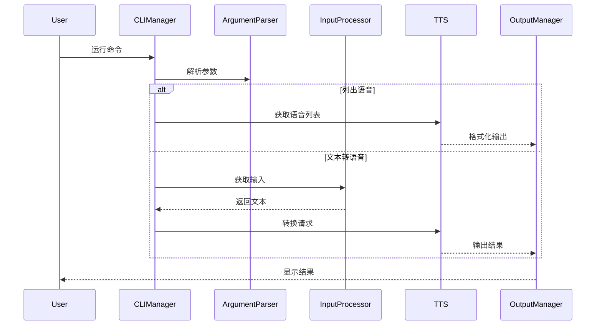

# Edge TTS Deno CLI设计

## 1. 设计目标

基于Python版本edge-tts的`util.py`实现，提供完整的命令行功能，包括：
- 文本转语音核心功能
- 语音列表管理
- 参数配置支持
- 输出控制

## 2. 命令行参数

### 2.1 参数定义

```typescript
interface CLIArgs {
  // 输入相关
  text?: string;              // 直接输入的文本
  file?: string;              // 输入文件路径
  
  // 语音相关
  voice?: string;             // 语音选择
  rate?: string;              // 语速控制 (+0%)
  volume?: string;            // 音量控制 (+0%)
  pitch?: string;            // 音调控制 (+0Hz)
  
  // 输出相关
  writeMedia?: string;       // 音频输出路径
  writeSubtitles?: string;   // 字幕输出路径
  wordsInCue?: number;      // 字幕分组词数
  
  // 功能控制
  listVoices?: boolean;      // 是否列出可用语音
  
  // 其他配置
  proxy?: string;            // 代理服务器
}
```

### 2.2 默认值

```typescript
const DEFAULT_CLI_CONFIG = {
  voice: "zh-CN-XiaoxiaoNeural",
  rate: "+0%",
  volume: "+0%",
  pitch: "+0Hz",
  wordsInCue: 10
};
```

## 3. 核心功能模块

### 3.1 参数解析器

```typescript
class ArgumentParser {
  parse(args: string[]): CLIArgs;
  validate(args: CLIArgs): void;
  printHelp(): void;
}
```

### 3.2 输入处理器

```typescript
interface InputProcessor {
  readFromStdin(): Promise<string>;
  readFromFile(path: string): Promise<string>;
}
```

### 3.3 输出管理器

```typescript
interface OutputManager {
  writeAudio(data: Uint8Array, path?: string): Promise<void>;
  writeSubtitles(data: string, path?: string): Promise<void>;
  printVoiceList(voices: Voice[]): void;
}
```

### 3.4 CLI管理器

```typescript
class CLIManager {
  async run(args: string[]): Promise<void>;
  private async handleVoiceList(): Promise<void>;
  private async handleTTS(args: CLIArgs): Promise<void>;
}
```

## 4. 主要流程



## 5. 错误处理

### 5.1 错误类型

```typescript
type CLIError = 
  | "INVALID_ARGS"      // 无效参数
  | "FILE_NOT_FOUND"    // 文件未找到
  | "PERMISSION_DENIED" // 权限不足
  | "IO_ERROR"         // IO错误
  | "TTS_ERROR"        // TTS服务错误
```

### 5.2 错误提示

- 格式化错误消息
- 提供修复建议
- 支持调试信息输出

## 6. 交互式提示

### 6.1 终端检查
- 检测是否为TTY终端
- 提供适当的交互提示
- 支持取消操作

### 6.2 进度显示
- 显示转换进度
- 支持长文本处理
- 错误状态反馈

## 7. 实现步骤

1. 基础框架搭建
   - [x] 项目结构
   - [ ] 类型定义
   - [ ] 基础类实现

2. 核心功能实现
   - [ ] 参数解析
   - [ ] 输入处理
   - [ ] 输出管理
   - [ ] TTS集成

3. 增强功能
   - [ ] 错误处理
   - [ ] 进度显示
   - [ ] 交互提示

4. 测试和文档
   - [ ] 单元测试
   - [ ] 集成测试
   - [ ] 使用文档