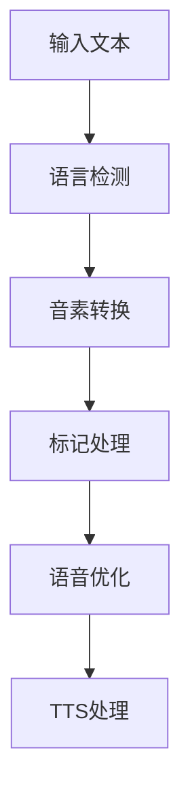

# Edge TTS Deno 设计方案 V1

> 注：本文档是对edge-tts-deno-design.md的完善和扩展版本，保留原文档作为初始设计参考。

## 1. 设计目标与原则

### 1.1 核心目标
- [~] 将Python版edge-tts重写为Deno版本
- [ ] 实现边缘函数部署能力
- [ ] 提供OpenAI API兼容接口
- [ ] 支持跨语言文本转写需求

### 1.2 参考实现对照表
| Deno实现 | 原edge-tts参考 |
|----------|----------------|
| `src/core/websocket_client.ts` | `src/edge_tts/communicate.py` |
| `src/utils/ssml.ts` | `src/edge_tts/util.py` (SSML相关部分) |
| `src/utils/drm.ts` | `src/edge_tts/drm.py` |
| `src/constants.ts` | `src/edge_tts/constants.py` |
| `src/types/config.ts` | `src/edge_tts/typing.py` |

## 7. 迭代路线图

### 7.1 第一阶段：基础框架（2周）
- [x] WebSocket客户端实现
  - [x] 基础连接管理
  - [x] 消息处理
  - [~] 重连机制
- [x] SSML生成器开发
  - [x] 模板系统
  - [x] 验证器
- [x] 基础错误处理
  - [x] 错误类型定义
  - [x] 全局错误处理
- [x] CLI工具实现
  - [x] 参数解析系统
  - [x] 输入输出处理
  - [x] 错误处理机制
  - [x] 交互式界面
  - [x] 文档说明

### 7.2 第二阶段：核心功能（2周）
- [ ] OpenAI协议适配
  - [ ] 请求转换
  - [ ] 响应适配
- [x] 音频流处理
  - [x] 流式传输
  - [x] 格式转换
- [ ] 字幕处理系统
  - [ ] 字幕流生成
  - [ ] 时间戳同步
  - [ ] 字幕合并优化
- [~] 性能优化
  - [ ] 连接池
  - [~] 缓存策略
- [ ] 语音管理系统
  - [ ] 语音列表获取
  - [ ] 语音特性分类
  - [ ] 语音信息格式化

### 7.3 第三阶段：生产就绪（2周）
- [ ] 监控系统集成
  - [ ] 指标收集
  - [ ] 日志系统
- [~] 安全加固
  - [x] DRM实现
  - [ ] 访问控制
- [ ] 部署自动化
  - [ ] CI/CD配置
  - [ ] 多环境支持
- [ ] 输出系统优化
  - [ ] 文件输出处理
  - [ ] 流输出管理
  - [ ] 错误输出规范

### 7.4 第四阶段：持续优化
- [ ] 缓存优化
  - [ ] 分布式缓存
  - [ ] 预热策略
- [ ] 性能调优
  - [ ] 负载均衡
  - [ ] 资源限制
- [ ] 参数配置系统
  - [ ] 语速控制
  - [ ] 音量调节
  - [ ] 音调设置
  - [ ] 代理支持
- [~] 文档完善
  - [x] 示例文档
  - [ ] API文档
  - [ ] 部署指南
  - [ ] CLI使用手册

## 8. 语言转写扩展设计

### 8.1 语言处理接口
```typescript
interface LanguageProcessor {
  // 语言检测
  detectLanguage(text: string): Promise<string>;
  
  // 音素转换
  convertPhonemes(text: string, fromLang: string, toLang: string): Promise<string>;
  
  // 标记处理
  processMarkers(text: string): Promise<ProcessedText>;
  
  // 语音合成优化
  optimizeSpeech(text: string, lang: string): Promise<string>;
}
```

### 8.2 语言配置
```typescript
interface LanguageConfig {
  // 支持的语言列表
  supportedLanguages: string[];
  
  // 语言特定设置
  languageSettings: Map<string, {
    preferredVoice: string;
    phonemeRules: PhonemeRule[];
    pronunciationGuide: PronunciationGuide;
  }>;
  
  // 转换规则
  conversionRules: Map<string, {
    from: string;
    to: string;
    rules: ConversionRule[];
  }>;
}
```

### 8.3 处理流程


## 9. 状态说明

### 9.1 当前实现进度
已完成功能：
- 基础WebSocket客户端
- SSML生成和解析
- DRM安全实现
- 音频流处理
- 基础示例程序
- 配置系统基础框架
- CLI工具完整实现
  - 参数解析系统
  - 输入输出处理
  - 交互式界面
  - 错误处理

进行中功能：
- 重连机制优化
- 性能调优
- 文档完善
- 字幕系统设计
- 语音管理接口

待实现功能：
- 字幕处理系统
- 输出系统优化
- 参数配置完善
- 语音列表管理

### 9.2 下一步计划
第一阶段剩余任务（本周）：
- 重连机制完善
  - 连接自动恢复
  - 错误重试策略
  - 状态同步管理
- 字幕处理系统
  - 字幕流生成器
  - SRT格式输出
  - 实时同步机制

第二阶段优先级（2-3周）：
- 语音管理系统
  - API接口实现
  - 缓存机制设计
  - 语音特性分类
- 性能优化
  - 连接池管理
  - 并发控制
  - 资源限制

第三阶段优先级（3-4周）：
- OpenAI兼容层
- 监控与日志
- 完整测试与文档

### 9.3 说明
- [x] 表示已完成的任务
- [~] 表示进行中的任务
- [ ] 表示待开始的任务