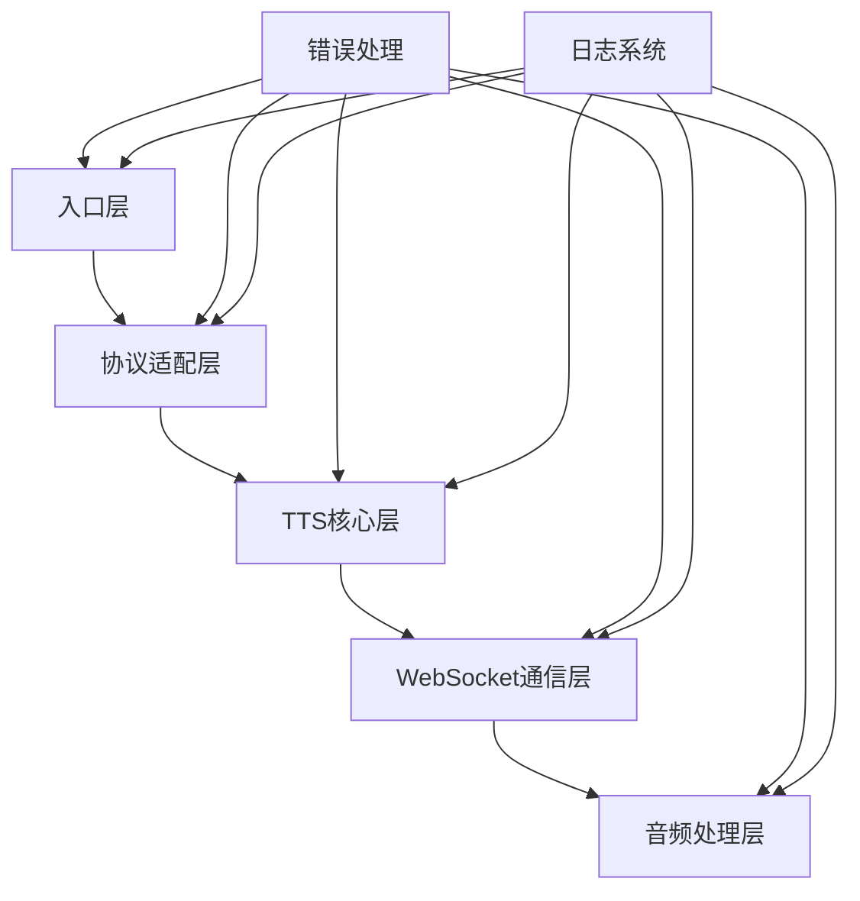
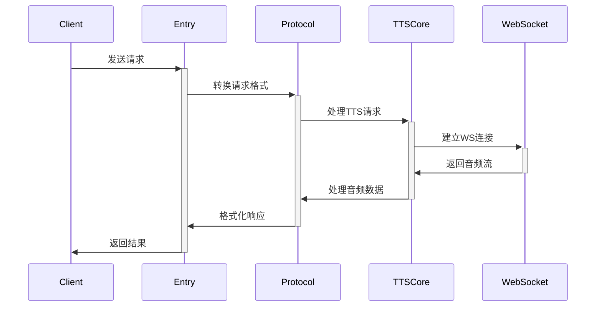

# Edge TTS Deno 开发规范文档

## 1. 架构设计

### 1.1 核心系统组件



#### 1.1.1 入口层 (Entry Layer)
- 负责处理HTTP和WebSocket请求
- 请求验证和认证
- 路由分发

#### 1.1.2 协议适配层 (Protocol Adapter)
- OpenAI API 兼容转换
- 请求/响应格式标准化
- 错误码映射

#### 1.1.3 TTS核心层 (TTS Core)
- 语音配置管理
- SSML生成
- 音频流控制

#### 1.1.4 WebSocket通信层 (WebSocket Communication)
- 连接管理
- 消息序列化/反序列化
- 重连机制

#### 1.1.5 音频处理层 (Audio Processing)
- 音频流处理
- 格式转换
- 缓冲管理

### 1.2 数据流



### 1.3 关键抽象和接口

```typescript
// 核心接口定义
interface TTSService {
  synthesize(text: string, config: TTSConfig): Promise<AudioStream>;
  getVoices(): Promise<Voice[]>;
  validateConfig(config: TTSConfig): boolean;
}

interface WebSocketClient {
  connect(): Promise<void>;
  send(data: unknown): Promise<void>;
  receive(): AsyncIterableIterator<unknown>;
  close(): Promise<void>;
}

interface AudioProcessor {
  process(input: AudioStream): AsyncIterableIterator<Uint8Array>;
  convert(format: AudioFormat): Promise<void>;
}
```

## 2. 第三方依赖

### 2.1 必需依赖

```typescript
// deps.ts
export {
  serve,
  type Handler
} from "https://deno.land/std@0.190.0/http/server.ts";

export {
  WebSocket,
  WebSocketClient
} from "https://deno.land/x/websocket@v0.1.4/mod.ts";

export {
  encode,
  decode
} from "https://deno.land/std@0.190.0/encoding/base64.ts";
```

### 2.2 开发依赖

```typescript
// dev_deps.ts
export {
  assertEquals,
  assertThrows
} from "https://deno.land/std@0.190.0/testing/asserts.ts";

export {
  mock,
  spy
} from "https://deno.land/x/mock@v0.3.0/mod.ts";
```

### 2.3 版本控制
- 使用 deps.ts 和 dev_deps.ts 集中管理依赖
- 锁定依赖版本，确保可重现构建
- 定期更新依赖检查安全问题

## 3. 项目结构

```
edge-tts-deno/
├── src/
│   ├── core/           # 核心TTS实现
│   │   ├── tts.ts
│   │   ├── websocket.ts
│   │   └── audio.ts
│   ├── adapters/       # 协议适配器
│   │   ├── openai.ts
│   │   └── edge.ts
│   ├── utils/          # 工具函数
│   │   ├── ssml.ts
│   │   └── streams.ts
│   └── types/          # 类型定义
│       └── index.ts
├── tests/              # 测试文件
│   ├── unit/
│   ├── integration/
│   └── e2e/
├── examples/           # 示例代码
├── scripts/            # 构建脚本
├── deps.ts            # 依赖管理
├── dev_deps.ts        # 开发依赖
├── mod.ts             # 模块入口
└── deno.json         # Deno配置
```

## 4. 编码规范

### 4.1 Deno Edge Functions 风格指南

#### 4.1.1 导入规范
```typescript
// 推荐
import { serve } from "./deps.ts";
import type { Handler } from "./deps.ts";

// 避免
import * as everything from "./module.ts";
```

#### 4.1.2 异步处理
```typescript
// 推荐
async function handleRequest(request: Request): Promise<Response> {
  try {
    const data = await processRequest(request);
    return new Response(JSON.stringify(data), {
      headers: { "Content-Type": "application/json" },
    });
  } catch (error) {
    return handleError(error);
  }
}

// 避免
function handleRequest(request: Request) {
  return processRequest(request)
    .then(data => new Response(JSON.stringify(data)))
    .catch(handleError);
}
```

### 4.2 文档要求

#### 4.2.1 文件头注释
```typescript
/**
 * @file TTS核心服务实现
 * @module core/tts
 * @description 提供TTS核心功能的实现，包括语音合成和流处理
 * @license MIT
 */
```

#### 4.2.2 函数文档
```typescript
/**
 * 将文本转换为语音流
 * @param text - 要转换的文本内容
 * @param config - TTS配置选项
 * @returns 音频数据流
 * @throws {TTSError} 当转换失败时
 * @example
 * ```ts
 * const stream = await synthesizeText("你好", defaultConfig);
 * ```
 */
async function synthesizeText(
  text: string,
  config: TTSConfig,
): Promise<AudioStream> {
  // 实现
}
```

### 4.3 错误处理模式

```typescript
// 自定义错误类
export class TTSError extends Error {
  constructor(
    message: string,
    public code: string,
    public status: number = 500,
  ) {
    super(message);
    this.name = "TTSError";
  }
}

// 错误处理
function handleError(error: unknown): Response {
  if (error instanceof TTSError) {
    return new Response(
      JSON.stringify({
        error: {
          message: error.message,
          code: error.code,
        },
      }),
      { status: error.status },
    );
  }
  
  return new Response(
    JSON.stringify({
      error: {
        message: "Internal Server Error",
        code: "INTERNAL_ERROR",
      },
    }),
    { status: 500 },
  );
}
```

### 4.4 日志约定

```typescript
interface LogContext {
  requestId: string;
  timestamp: number;
  level: "debug" | "info" | "warn" | "error";
}

const logger = {
  info(message: string, context: LogContext) {
    console.log(JSON.stringify({ message, ...context }));
  },
  error(message: string, error: Error, context: LogContext) {
    console.error(JSON.stringify({
      message,
      error: {
        name: error.name,
        message: error.message,
        stack: error.stack,
      },
      ...context,
    }));
  },
};
```

## 5. 命名规范

### 5.1 文件命名
- 模块文件：小写，使用连字符，如 `audio-processor.ts`
- 类型定义：小写，使用连字符，以 `.d.ts` 结尾
- 测试文件：与被测试文件同名，添加 `.test.ts` 后缀

### 5.2 类/接口命名
- 使用 PascalCase
- 接口名以描述性词开头，如 `AudioProcessor`
- 抽象类以 "Base" 或 "Abstract" 开头

### 5.3 变量/函数命名
- 使用 camelCase
- 布尔变量使用 "is"、"has"、"should" 等前缀
- 异步函数使用动词开头，如 `async function fetchVoices()`

### 5.4 常量命名
- 使用大写 SNAKE_CASE
- 配置键使用小写 snake_case

## 6. 实现计划

### 6.1 核心功能优先级

1. Phase 1 - 基础架构 (周 1-2)
   - WebSocket 客户端实现
   - SSML 生成器
   - 基础错误处理

2. Phase 2 - 核心功能 (周 3-4)
   - TTS 核心服务
   - 音频流处理
   - OpenAI 协议适配

3. Phase 3 - 增强功能 (周 5-6)
   - 缓存层实现
   - 性能优化
   - 监控集成

### 6.2 测试策略

#### 6.2.1 单元测试
```typescript
Deno.test("TTSService.synthesize", async () => {
  const service = new TTSService(mockConfig);
  const audio = await service.synthesize("测试文本", defaultConfig);
  assertEquals(audio instanceof AudioStream, true);
});
```

#### 6.2.2 集成测试
```typescript
Deno.test("完整TTS流程", async () => {
  const request = new Request("http://localhost/v1/audio/speech", {
    method: "POST",
    body: JSON.stringify({
      input: "测试文本",
      voice: "zh-CN-XiaoxiaoNeural",
    }),
  });
  
  const response = await handleRequest(request);
  assertEquals(response.status, 200);
});
```

### 6.3 部署考虑

#### 6.3.1 环境配置
```typescript
// config.ts
export const config = {
  development: {
    wsUrl: "wss://dev-tts.edge.com",
    timeout: 30000,
  },
  production: {
    wsUrl: "wss://tts.edge.com",
    timeout: 15000,
  },
}[Deno.env.get("ENVIRONMENT") || "development"];
```

#### 6.3.2 健康检查
```typescript
async function healthCheck(): Promise<Response> {
  try {
    await checkConnectivity();
    return new Response("OK", { status: 200 });
  } catch (error) {
    return new Response("Service Unavailable", { status: 503 });
  }
}
```

#### 6.3.3 监控指标
```typescript
interface Metrics {
  requestCount: number;
  errorCount: number;
  latency: number[];
  audioSize: number[];
}

const metrics: Metrics = {
  requestCount: 0,
  errorCount: 0,
  latency: [],
  audioSize: [],
};
```

## 7. 后续开发建议

1. 代码评审流程
   - 使用 Pull Request
   - 要求测试覆盖
   - 性能基准测试

2. 持续集成
   - GitHub Actions 配置
   - 自动化测试
   - 部署流程

3. 文档维护
   - API 文档自动生成
   - 更新日志维护
   - 示例代码更新